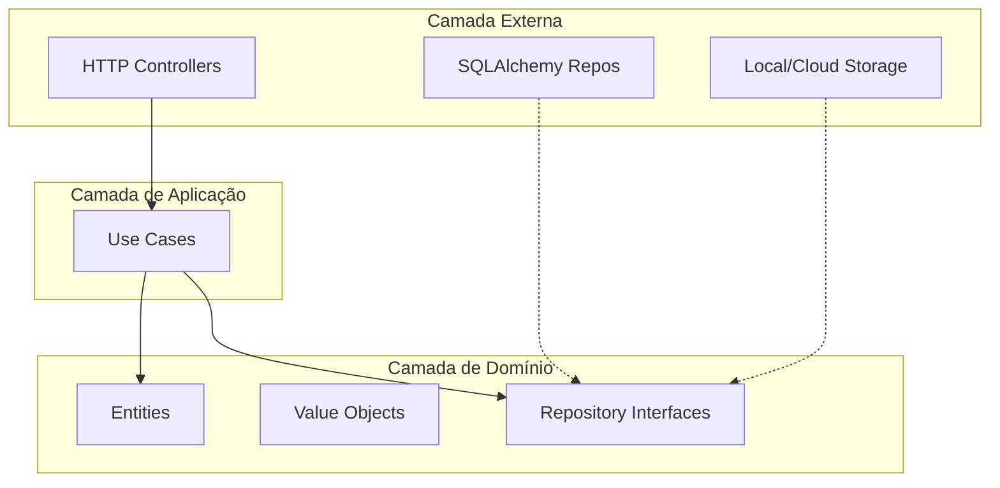

# Arquitetura do Sistema — Filadelfias

## 📋 Visão Geral
O **Filadelfias** é uma plataforma multi-tenant para gestão eclesiástica, composta por:
- **Backend API** (Python/FastAPI)
- **Aplicação Web** (React/Vite)
- **Aplicação Mobile** (React Native/Expo)
- **Contratos Compartilhados** (Zod/TypeScript)

---

## 🏗️ Arquitetura de Alto Nível

```
┌─────────────────────────────────────────────────────────────────────────────┐
│                              CLIENTES                                        │
├─────────────────┬─────────────────┬─────────────────────────────────────────┤
│   Web (React)   │  Mobile (Expo)  │         Painel Admin (Web)              │
└────────┬────────┴────────┬────────┴────────────────┬────────────────────────┘
         │                 │                         │
         │                 │ HTTPS/JSON              │
         ▼                 ▼                         ▼
┌─────────────────────────────────────────────────────────────────────────────┐
│                         API GATEWAY / LOAD BALANCER                          │
│                           (Google Cloud Run)                                 │
└─────────────────────────────────────────────────────────────────────────────┘
                                    │
                                    ▼
┌─────────────────────────────────────────────────────────────────────────────┐
│                           BACKEND (FastAPI)                                  │
│  ┌─────────────┐  ┌─────────────┐  ┌─────────────┐  ┌─────────────┐         │
│  │   API       │  │ Application │  │   Domain    │  │   Infra     │         │
│  │ Controllers │──│  Use Cases  │──│  Entities   │──│ Repositories│         │
│  └─────────────┘  └─────────────┘  └─────────────┘  └─────────────┘         │
└─────────────────────────────────────────────────────────────────────────────┘
         │                    │                              │
         ▼                    ▼                              ▼
┌─────────────────┐  ┌─────────────────┐          ┌─────────────────┐
│    Firestore    │  │  Redis (Cache)  │          │  Cloud Storage  │
│   (NoSQL DB)    │  │   (Opcional)    │          │  (Firebase)     │
└─────────────────┘  └─────────────────┘          └─────────────────┘
```

---

## 🎯 Princípios Arquiteturais

### 1. Clean Architecture
O backend segue a Clean Architecture (Ports & Adapters):
- **Domain**: Entidades, Value Objects e regras de negócio puras.
- **Application**: Use Cases que orquestram a lógica.
- **Infrastructure**: Implementações concretas (DB, S3, APIs externas).
- **API**: Controllers HTTP (FastAPI routers).



### 2. Multi-Tenancy
- **Isolamento Lógico**: Todas as queries filtram por `tenant_id`.
- **Identificação**: Via header `X-Tenant-ID` ou contexto de autenticação.
- **Usuário Global**: O usuário existe independente de tenants.

### 3. Async First
- Todos os endpoints são `async def`.
- Drivers assíncronos: `asyncpg`, `httpx`.

---

## 📂 Estrutura de Diretórios

```
filadelfias/
├── apps/
│   ├── backend/
│   │   ├── src/
│   │   │   ├── api/           # Routers FastAPI
│   │   │   ├── application/   # Use Cases
│   │   │   ├── domain/        # Entities, Value Objects
│   │   │   ├── infra/         # Repositories, External Services
│   │   │   └── main.py        # Entrypoint
│   │   ├── tests/
│   │   ├── alembic/           # Migrações
│   │   └── pyproject.toml
│   │
│   ├── web/
│   │   ├── src/
│   │   │   ├── components/    # Componentes UI
│   │   │   ├── features/      # Módulos por feature
│   │   │   ├── hooks/         # Custom hooks
│   │   │   ├── lib/           # Utilitários
│   │   │   └── routes/        # Páginas (React Router)
│   │   ├── public/
│   │   └── package.json
│   │
│   └── mobile/
│       ├── app/               # Expo Router (file-based)
│       ├── components/
│       └── package.json
│
├── packages/
│   └── contracts/             # Zod schemas compartilhados
│
├── docs/                      # Documentação técnica
├── plan/                      # Planejamento de fases
├── templates/                 # Referências visuais
└── docker-compose.yml
```

---

## 🔐 Segurança

### Autenticação
- **JWT** (Access Token + Refresh Token).
- Tokens assinados com RS256 (chave privada no servidor).
- Refresh token armazenado em `httpOnly cookie` (Web) ou Secure Storage (Mobile).

### Autorização (RBAC)
- Roles definidas por tenant (`user_church_memberships`).
- Permissões verificadas via decorator `@require_permission("resource:action")`.

### Dados Sensíveis
- Senhas: `bcrypt` ou `argon2`.
- Dados financeiros: Logs de auditoria imutáveis.
- Dados disciplinares: Apenas Pastor, sem detalhes no banco cloud.

---

## 🌐 Infraestrutura (Homelab K3s)

> **Nota sobre infraestrutura**: Desde Março/2026, o projeto está hospedado em um **Homelab privado**
> usando Kubernetes (K3s via Rancher) com Cloudflare Zero Trust para roteamento público.
> Essa escolha oferece **controle total**, **custo baixo** ($0/mês) e aprendizado em infraestrutura.

| Componente | Serviço | Configuração |
|------------|---------|--------------|
| Backend API | K3s Deployment | Container Python (1 replica) |
| Web | K3s Deployment | Container Nginx (1 replica) |
| Database | PostgreSQL 16 | StatefulSet com PVC 10Gi |
| Proxy/CDN | Cloudflare Zero Trust | Tunnel + Cache rules |
| Auth | JWT próprio (backend) | RS256 tokens |
| CI/CD | GitHub Actions + Fleet | Build → Push GHCR → GitOps |

---

## 📡 Comunicação

### APIs Externas Consumidas
| API | Uso | Autenticação |
|-----|-----|--------------|
| A Bíblia Digital | Versões online da Bíblia | API Key |

### Notificações
- **Push**: Expo Push Notifications (Mobile), Web Push API.
- **Email**: SMTP simples ou Resend/Mailgun.
