# Modelo Entidade-Relacionamento (ERD) — Filadelfias

Este documento descreve as entidades do banco de dados e seus relacionamentos.

---

## 📊 Diagrama Geral (Mermaid)

```mermaid
erDiagram
    %% === PLATAFORMA ===
    USERS ||--o{ USER_CHURCH_MEMBERSHIPS : "tem múltiplas associações"
    TENANTS ||--o{ USER_CHURCH_MEMBERSHIPS : "possui membros"
    USERS ||--o{ ATTENDANCE_LOG : "registra presença"
    
    %% === RBAC ===
    ROLES ||--o{ ROLE_PERMISSIONS : "possui"
    PERMISSIONS ||--o{ ROLE_PERMISSIONS : "atribuída a"
    
    %% === CONTEÚDO ===
    TENANTS ||--o{ BULLETINS : "publica"
    USERS ||--o{ BULLETINS : "autor"
    TENANTS ||--o{ SONGS : "possui"
    
    %% === COMUNIDADE ===
    USERS ||--o| MEMBER_PROFILES : "possui perfil"
    TENANTS ||--o{ PRAYER_REQUESTS : "recebe pedidos"
    USERS ||--o{ PRAYER_REQUESTS : "cria"
    TENANTS ||--o{ EVENTS : "agenda"
    EVENTS ||--o{ ATTENDANCE_LOG : "registra presença"
    
    %% === MINISTÉRIOS ===
    TENANTS ||--o{ MINISTRIES : "possui"
    MINISTRIES ||--o{ VOLUNTEERS : "tem voluntários"
    USERS ||--o{ VOLUNTEERS : "participa"
    MINISTRIES ||--o{ ROSTERS : "gera escalas"
    ROSTERS ||--o{ ROSTER_SLOTS : "contém posições"
    
    %% === EBD ===
    TENANTS ||--o{ EBD_CLASSES : "oferece"
    EBD_CLASSES ||--o{ LESSONS : "possui lições"
    EBD_CLASSES ||--o{ EBD_ATTENDANCE : "registra chamada"
    
    %% === GOVERNO ===
    TENANTS ||--o{ ASSEMBLIES : "convoca"
    ASSEMBLIES ||--o{ ASSEMBLY_AGENDA_ITEMS : "tem pauta"
    TENANTS ||--o{ ELECTIONS : "realiza"
    ELECTIONS ||--o{ CANDIDATES : "tem candidatos"
    ELECTIONS ||--o{ VOTES : "recebe votos"
    TENANTS ||--o{ MINUTES : "registra atas"
    
    %% === FINANCEIRO ===
    TENANTS ||--o{ LEDGER_ENTRIES : "lança"
    TENANTS ||--o{ LEDGER_CATEGORIES : "define categorias"
    USERS ||--o{ CONTRIBUTIONS : "envia comprovantes"
    
    %% === MISSÕES ===
    TENANTS ||--o{ MISSIONARIES : "apoia"
```

---

## 📋 Detalhamento das Entidades

### 🔐 Plataforma e Acesso

#### `users` — Usuários Globais
| Coluna | Tipo | Descrição |
|--------|------|-----------|
| `id` | UUID | PK |
| `email` | VARCHAR(255) | Único, login |
| `password_hash` | VARCHAR(255) | Senha criptografada |
| `name` | VARCHAR(255) | Nome completo |
| `avatar_url` | TEXT | URL da foto |
| `is_active` | BOOLEAN | Conta ativa? |
| `created_at` | TIMESTAMP | Data de criação |

---

#### `tenants` — Igrejas
| Coluna | Tipo | Descrição |
|--------|------|-----------|
| `id` | UUID | PK |
| `name` | VARCHAR(255) | Nome da igreja |
| `slug` | VARCHAR(100) | Identificador único (URL) |
| `logo_url` | TEXT | Logo |
| `address` | TEXT | Endereço completo |
| `latitude` | DECIMAL(10,8) | Coordenada |
| `longitude` | DECIMAL(11,8) | Coordenada |
| `is_public` | BOOLEAN | Visível no mapa? |
| `created_at` | TIMESTAMP | Data de criação |

---

#### `user_church_memberships` — Vínculos Usuário ↔ Igreja
| Coluna | Tipo | Descrição |
|--------|------|-----------|
| `id` | UUID | PK |
| `user_id` | UUID | FK → `users` |
| `tenant_id` | UUID | FK → `tenants` |
| `role` | VARCHAR(50) | Role nesta igreja |
| `status` | VARCHAR(20) | ACTIVE, INACTIVE, PENDING |
| `joined_at` | TIMESTAMP | Data de entrada |
| `invited_by` | UUID | FK → `users` (quem convidou) |

**Constraint**: `UNIQUE(user_id, tenant_id)`

---

#### `attendance_log` — Histórico de Frequência
| Coluna | Tipo | Descrição |
|--------|------|-----------|
| `id` | UUID | PK |
| `user_id` | UUID | FK → `users` |
| `tenant_id` | UUID | FK → `tenants` |
| `event_id` | UUID | FK → `events` (opcional) |
| `checked_in_at` | TIMESTAMP | Data/hora do check-in |
| `method` | VARCHAR(20) | QR_CODE, MANUAL, GEO |

---

### 📖 Conteúdo

#### `bible_verses` — Versículos da Bíblia (ARC)
| Coluna | Tipo | Descrição |
|--------|------|-----------|
| `id` | UUID | PK |
| `book` | VARCHAR(50) | Nome do livro |
| `book_abbrev` | VARCHAR(10) | Abreviação (Gn, Ex, Lv) |
| `chapter` | INTEGER | Número do capítulo |
| `verse` | INTEGER | Número do versículo |
| `text` | TEXT | Texto do versículo |
| `version` | VARCHAR(20) | ARC, ACF, etc. |

**Index**: `(book, chapter, verse, version)`

---

#### `songs` — Hinos/Cânticos
| Coluna | Tipo | Descrição |
|--------|------|-----------|
| `id` | UUID | PK |
| `tenant_id` | UUID | FK → `tenants` (ou NULL para global) |
| `number` | INTEGER | Número no hinário |
| `title` | VARCHAR(255) | Título |
| `author` | VARCHAR(255) | Autor/Compositor |
| `lyrics` | TEXT | Letra completa |
| `key` | VARCHAR(10) | Tonalidade (C, D, Em) |
| `created_at` | TIMESTAMP | |

---

#### `bulletins` — Boletins
| Coluna | Tipo | Descrição |
|--------|------|-----------|
| `id` | UUID | PK |
| `tenant_id` | UUID | FK → `tenants` |
| `title` | VARCHAR(255) | Título |
| `content` | TEXT | Conteúdo (Markdown/HTML) |
| `published_at` | TIMESTAMP | Data de publicação |
| `author_id` | UUID | FK → `users` |
| `is_public` | BOOLEAN | Visível para visitantes? |

---

### 👥 Comunidade

#### `member_profiles` — Perfil Eclesiástico
| Coluna | Tipo | Descrição |
|--------|------|-----------|
| `id` | UUID | PK |
| `user_id` | UUID | FK → `users` |
| `tenant_id` | UUID | FK → `tenants` |
| `birth_date` | DATE | Data de nascimento |
| `baptism_date` | DATE | Data de batismo |
| `admission_date` | DATE | Data de admissão |
| `admission_mode` | VARCHAR(50) | BAPTISM, TRANSFER, PROFESSION |
| `marital_status` | VARCHAR(20) | SINGLE, MARRIED, WIDOWED |
| `spouse_id` | UUID | FK → `users` (se casado com membro) |
| `phone` | VARCHAR(20) | Telefone |
| `address` | TEXT | Endereço |
| `privacy_settings` | JSONB | { showPhone: false, showAddress: false } |

---

#### `prayer_requests` — Pedidos de Oração
| Coluna | Tipo | Descrição |
|--------|------|-----------|
| `id` | UUID | PK |
| `tenant_id` | UUID | FK → `tenants` |
| `author_id` | UUID | FK → `users` (NULL = anônimo) |
| `description` | TEXT | Descrição do pedido |
| `visibility` | VARCHAR(20) | PUBLIC, LEADERS_ONLY, PRIVATE |
| `is_answered` | BOOLEAN | Oração respondida? |
| `created_at` | TIMESTAMP | |

---

#### `events` — Eventos
| Coluna | Tipo | Descrição |
|--------|------|-----------|
| `id` | UUID | PK |
| `tenant_id` | UUID | FK → `tenants` |
| `title` | VARCHAR(255) | Nome do evento |
| `description` | TEXT | Detalhes |
| `event_type` | VARCHAR(50) | WORSHIP, EBD, VIGIL, MEETING |
| `starts_at` | TIMESTAMP | Início |
| `ends_at` | TIMESTAMP | Fim |
| `location` | TEXT | Local |
| `requires_checkin` | BOOLEAN | Exige check-in? |

---

### 🎵 Ministérios

#### `ministries` — Ministérios
| Coluna | Tipo | Descrição |
|--------|------|-----------|
| `id` | UUID | PK |
| `tenant_id` | UUID | FK → `tenants` |
| `name` | VARCHAR(100) | Nome (Louvor, Mídia, Recepção) |
| `description` | TEXT | |

---

#### `volunteers` — Voluntários
| Coluna | Tipo | Descrição |
|--------|------|-----------|
| `id` | UUID | PK |
| `user_id` | UUID | FK → `users` |
| `ministry_id` | UUID | FK → `ministries` |
| `role` | VARCHAR(50) | MEMBER, LEADER |
| `joined_at` | TIMESTAMP | |

---

#### `rosters` — Escalas
| Coluna | Tipo | Descrição |
|--------|------|-----------|
| `id` | UUID | PK |
| `ministry_id` | UUID | FK → `ministries` |
| `event_id` | UUID | FK → `events` (opcional) |
| `date` | DATE | Data da escala |
| `created_by` | UUID | FK → `users` |

---

#### `roster_slots` — Posições na Escala
| Coluna | Tipo | Descrição |
|--------|------|-----------|
| `id` | UUID | PK |
| `roster_id` | UUID | FK → `rosters` |
| `volunteer_id` | UUID | FK → `volunteers` |
| `function` | VARCHAR(100) | Função (Vocal, Guitarra, Operador) |
| `status` | VARCHAR(20) | PENDING, CONFIRMED, DECLINED |

---

### ⚖️ Governo

#### `elections` — Eleições
| Coluna | Tipo | Descrição |
|--------|------|-----------|
| `id` | UUID | PK |
| `tenant_id` | UUID | FK → `tenants` |
| `title` | VARCHAR(255) | Título da eleição |
| `office` | VARCHAR(100) | Cargo (Presbítero, Diácono) |
| `starts_at` | TIMESTAMP | Início da votação |
| `ends_at` | TIMESTAMP | Fim da votação |
| `status` | VARCHAR(20) | DRAFT, OPEN, CLOSED |

---

#### `votes` — Votos (Anônimos)
| Coluna | Tipo | Descrição |
|--------|------|-----------|
| `id` | UUID | PK |
| `election_id` | UUID | FK → `elections` |
| `candidate_id` | UUID | FK → `candidates` |
| `vote_hash` | VARCHAR(64) | Hash para auditoria |
| `voted_at` | TIMESTAMP | |

**Nota**: Não há FK para `users` para garantir anonimato.

---

### 💰 Financeiro

#### `ledger_entries` — Lançamentos
| Coluna | Tipo | Descrição |
|--------|------|-----------|
| `id` | UUID | PK |
| `tenant_id` | UUID | FK → `tenants` |
| `category_id` | UUID | FK → `ledger_categories` |
| `type` | VARCHAR(10) | INCOME, EXPENSE |
| `amount` | DECIMAL(12,2) | Valor |
| `description` | TEXT | Descrição |
| `date` | DATE | Data do lançamento |
| `receipt_url` | TEXT | Comprovante |
| `created_by` | UUID | FK → `users` |

---

## 🔗 Relacionamentos Chave

| Entidade A | Relação | Entidade B | Cardinalidade |
|------------|---------|------------|---------------|
| `users` | pertence a | `tenants` | N:N (via `user_church_memberships`) |
| `users` | cria | `bulletins` | 1:N |
| `tenants` | possui | `events` | 1:N |
| `events` | registra | `attendance_log` | 1:N |
| `ministries` | tem | `rosters` | 1:N |
| `rosters` | contém | `roster_slots` | 1:N |
| `elections` | tem | `votes` | 1:N |
