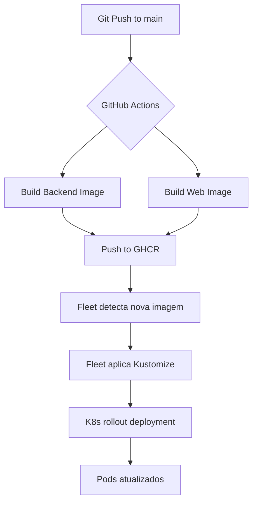

# CI/CD — Pipeline de Deploy Automatizado

**Ferramentas:** GitHub Actions + Fleet GitOps  
**Registry:** GitHub Container Registry (GHCR)  
**Deploy Target:** Homelab K3s

---

## 📋 Visão Geral

O Filadelfias utiliza um pipeline CI/CD totalmente automatizado:

1. **Build & Test** → GitHub Actions
2. **Publish Images** → GitHub Container Registry
3. **Deploy** → Fleet GitOps (monitora repositório)
4. **Rollout** → Kubernetes aplica mudanças

---

## 🔄 Fluxo Completo



---

## 🏗️ GitHub Actions Workflows

### 1. Homelab Images Build

**Arquivo:** `.github/workflows/homelab-images.yml`

**Triggers:**
- Push em `main` nos paths:
  - `apps/backend/**`
  - `apps/web/**`
  - `.github/workflows/homelab-images.yml`
- Dispatch manual

**Jobs:**

#### Backend Job
```yaml
- Checkout código
- Setup Docker Buildx
- Login no GHCR (ghcr.io)
- Build da imagem (apps/backend/Dockerfile)
- Push com tags:
  - ghcr.io/l3co/filadelfias-backend:latest
  - ghcr.io/l3co/filadelfias-backend:sha-{commit-hash}
```

#### Web Job
```yaml
- Checkout código
- Setup Docker Buildx
- Login no GHCR (ghcr.io)
- Build da imagem (apps/web/Dockerfile)
- Push com tags:
  - ghcr.io/l3co/filadelfias-web:latest
  - ghcr.io/l3co/filadelfias-web:sha-{commit-hash}
```

**Duração típica:** 3-5 minutos por job (paralelos)

---

### 2. Web CI (Testes)

**Arquivo:** `.github/workflows/web.yml`

**Triggers:**
- Push/PR em `main` nos paths:
  - `apps/web/**`
  - `.github/workflows/web.yml`

**Jobs:**

#### Lint
- ESLint
- TypeScript type checking

#### Unit Tests
- Vitest com coverage
- Upload para Codecov

#### E2E Tests (Playwright + Cucumber)
- Setup PostgreSQL via services
- Seed banco de dados
- Start backend (uvicorn)
- Build e start frontend (preview)
- Executar testes:
  - `@smoke` tags (PR)
  - Full suite (manual dispatch)
- Upload de reports (Playwright + Cucumber)

**Duração típica:** 5-10 minutos

---

### 3. Backend CI (Futuro)

**Planejado:**
- pytest com coverage
- mypy type checking
- ruff/black linting
- Security scanning (bandit)

---

## 🐳 Docker Images

### Backend Image

**Base:** `python:3.11-slim`

**Processo:**
1. Install dependencies (Poetry)
2. Copy source code
3. Expose port 8000
4. CMD: `uvicorn src.main:app --host 0.0.0.0 --port 8000`

**Otimizações:**
- Multi-stage build (futuro)
- Layer caching via Buildx
- Slim base image

**Tamanho:** ~500MB

---

### Web Image

**Base:** `node:22-alpine` (build) + `nginx:alpine` (runtime)

**Processo:**
1. **Build stage:**
   - npm ci
   - npm run build (Vite)
2. **Runtime stage:**
   - Copy nginx config
   - Copy built assets (`dist/`)
   - Copy entrypoint script
   - Expose port 8080

**Entrypoint:** `docker-entrypoint.sh`
- Injeta `API_URL` em runtime no `config.js`
- Atualiza CSP headers no `index.html`
- Start nginx

**Tamanho:** ~50MB

---

## 🚀 Fleet GitOps

### Configuração

**Arquivo:** `fleet.yaml` (raiz do projeto)

```yaml
defaultNamespace: filadelfias

kustomize:
  dir: k8s/homelab
```

### Funcionamento

1. Fleet monitora o repositório GitHub
2. Detecta mudanças em `k8s/homelab/**`
3. Executa `kubectl apply -k k8s/homelab/`
4. Deployments com `imagePullPolicy: Always` detectam nova tag `latest`
5. Kubernetes faz rolling update automático

### Vantagens

- **GitOps nativo:** Git como fonte única de verdade
- **Declarativo:** Manifestos K8s versionados
- **Automático:** Zero intervenção manual
- **Auditável:** Todas as mudanças rastreadas no Git

---

## 📦 GitHub Container Registry

### Autenticação

**Para CI/CD:**
- GitHub Actions usa `GITHUB_TOKEN` automático
- Permissão: `packages: write`

**Para K8s (pull):**
```bash
kubectl create secret docker-registry ghcr-secret \
  --docker-server=ghcr.io \
  --docker-username=l3co \
  --docker-password=ghp_TOKEN_AQUI \
  -n filadelfias
```

### Visibilidade

- Imagens públicas: Não requer autenticação para pull
- Imagens privadas: Requer `ghcr-secret` no K8s

### Limpeza

Política de retenção (configurável):
- Manter `latest`
- Manter últimos 10 `sha-*`
- Deletar imagens > 30 dias sem uso

---

## 🔐 Secrets e Variáveis

### GitHub Secrets (Actions)

| Secret | Uso |
|---|---|
| `GITHUB_TOKEN` | Push para GHCR (automático) |

**Futuro:**
- `CODECOV_TOKEN` (opcional)

### Kubernetes Secrets

Gerenciados manualmente (não via CI/CD):
- `filadelfias-secrets` (POSTGRES_PASSWORD, SECRET_KEY)
- `ghcr-secret` (pull de imagens)

---

## 🧪 Estratégia de Testes

### Pull Request
```
Lint → Unit Tests → E2E (@smoke)
```
- Rápido (~5 min)
- Feedback imediato

### Main Branch
```
Build Images → Push GHCR → Fleet Deploy
```
- Sem testes (confiança nos testes de PR)
- Deploy automático

### Manual Dispatch
```
Full E2E Suite (todos os testes)
```
- Antes de releases importantes
- Validação completa

---

## 📊 Monitoramento de Deploy

### Verificar Status do Workflow

GitHub → Actions → Ver execuções

### Verificar Imagens Publicadas

```bash
# Via GitHub CLI
gh api /user/packages/container/filadelfias-backend/versions

# Via web
https://github.com/l3co?tab=packages
```

### Verificar Deploy no Cluster

```bash
# Ver se pod atualizou
kubectl -n filadelfias get pods
kubectl -n filadelfias describe deployment/backend

# Ver imagem atual
kubectl -n filadelfias get deployment/backend -o jsonpath='{.spec.template.spec.containers[0].image}'

# Ver logs do rollout
kubectl -n filadelfias rollout status deployment/backend
kubectl -n filadelfias rollout history deployment/backend
```

---

## 🐛 Troubleshooting

### Build falhou no GitHub Actions

**Diagnóstico:**
- Ver logs no GitHub Actions
- Checar erros de compilação/lint/testes

**Soluções comuns:**
- Falha de lint → Corrigir código
- Falha de testes → Corrigir testes
- Timeout → Aumentar timeout no workflow

---

### Imagem não atualiza no cluster

**Diagnóstico:**
```bash
kubectl -n filadelfias get events --sort-by='.lastTimestamp'
kubectl -n filadelfias describe pod <pod-name>
```

**Causas comuns:**

1. **ImagePullBackOff**
   - Secret `ghcr-secret` inválido ou ausente
   - Imagem privada sem permissão

2. **Pod não reinicia**
   - `imagePullPolicy` não é `Always`
   - Deployment não foi modificado (Fleet não detectou)

3. **Rollout travado**
   - Health check falhando
   - Recursos insuficientes

**Soluções:**
```bash
# Forçar pull da imagem
kubectl -n filadelfias rollout restart deployment/backend

# Verificar secret
kubectl -n filadelfias get secret ghcr-secret

# Ver por que health check falha
kubectl -n filadelfias logs deployment/backend
```

---

### Fleet não aplica mudanças

**Diagnóstico:**
- Verificar logs do Fleet controller
- Confirmar que mudança está em `k8s/homelab/`

**Forçar sync:**
```bash
# Aplicar manualmente
kubectl apply -k k8s/homelab/
```

---

## 🔄 Rollback

### Via Kubernetes

```bash
# Ver histórico
kubectl -n filadelfias rollout history deployment/backend

# Rollback para versão anterior
kubectl -n filadelfias rollout undo deployment/backend

# Rollback para revisão específica
kubectl -n filadelfias rollout undo deployment/backend --to-revision=3
```

### Via Git

```bash
# Reverter commit
git revert <commit-hash>
git push origin main

# Fleet aplicará automaticamente
```

---

## 📈 Melhorias Futuras

### Curto Prazo
- [ ] Adicionar backend CI (pytest, mypy)
- [ ] Cache de dependências no Docker build
- [ ] Notificações de deploy (Slack/Discord)

### Médio Prazo
- [ ] Staging environment (namespace separado)
- [ ] Canary deployments
- [ ] Automated rollback on failure
- [ ] Performance tests no CI

### Longo Prazo
- [ ] Multi-cluster deploy
- [ ] Blue-green deployments
- [ ] Chaos engineering
- [ ] Continuous deployment (CD completo)

---

## 📚 Referências

- [GitHub Actions Documentation](https://docs.github.com/en/actions)
- [Fleet Documentation](https://fleet.rancher.io/)
- [GHCR Documentation](https://docs.github.com/en/packages/working-with-a-github-packages-registry/working-with-the-container-registry)
- [Kubernetes Deployments](https://kubernetes.io/docs/concepts/workloads/controllers/deployment/)

---

**Pipeline mantido por:** @l3co  
**Tempo médio de deploy:** 5-8 minutos (commit → produção)
