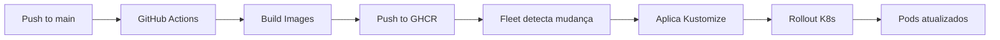

# Infraestrutura Homelab — Filadelfias

**Status:** Produção  
**Última atualização:** Março 2026

---

## 📋 Visão Geral

O Filadelfias está hospedado em um **Homelab privado** utilizando Kubernetes (K3s via Rancher) e integração com Cloudflare Zero Trust para roteamento público.

### Principais Componentes

| Componente | Tecnologia | Função |
|---|---|---|
| **Orquestração** | K3s (OpenSUSE) via Rancher | Gerenciamento de containers |
| **GitOps** | Fleet (integrado ao GitHub) | Deploy automatizado |
| **Proxy/CDN** | Cloudflare Zero Trust | Roteamento e segurança |
| **Banco de Dados** | PostgreSQL 16 | Persistência relacional |
| **Registry** | GitHub Container Registry (GHCR) | Armazenamento de imagens Docker |

---

## 🏗️ Arquitetura de Infraestrutura

```
┌─────────────────────────────────────────────────────────────┐
│                    INTERNET / USUÁRIOS                       │
└────────────────────────┬────────────────────────────────────┘
                         │
                         ▼
┌─────────────────────────────────────────────────────────────┐
│              Cloudflare Zero Trust Tunnel                    │
│  ┌──────────────────────┬─────────────────────────────┐     │
│  │ filadelfias.com      │ api.filadelfias.com         │     │
│  └──────────┬───────────┴──────────────┬──────────────┘     │
└─────────────┼────────────────────────────┼──────────────────┘
              │                            │
              ▼                            ▼
┌──────────────────────────────────────────────────────────────┐
│                    HOMELAB (K3s Cluster)                      │
│  ┌──────────────────┐            ┌──────────────────┐        │
│  │  Web Service     │            │  Backend Service │        │
│  │  (port 8080)     │            │  (port 8000)     │        │
│  └────────┬─────────┘            └────────┬─────────┘        │
│           │                               │                  │
│           ▼                               ▼                  │
│  ┌──────────────────┐            ┌──────────────────┐        │
│  │  Web Deployment  │            │ Backend Deploy   │        │
│  │  (1 replica)     │            │ (1 replica)      │        │
│  │  ghcr.io/web     │            │ ghcr.io/backend  │        │
│  └──────────────────┘            └────────┬─────────┘        │
│                                           │                  │
│                                           ▼                  │
│                                  ┌──────────────────┐        │
│                                  │  PostgreSQL      │        │
│                                  │  (StatefulSet)   │        │
│                                  │  PVC 10Gi        │        │
│                                  └──────────────────┘        │
└──────────────────────────────────────────────────────────────┘
```

---

## 🔄 Pipeline CI/CD

### Fluxo de Deploy Automatizado



### Detalhamento por Etapa

#### 1. Push no GitHub
Qualquer commit em `main` nos paths:
- `apps/backend/**`
- `apps/web/**`
- `k8s/homelab/**`

#### 2. GitHub Actions Build
Workflow: `.github/workflows/homelab-images.yml`
- Constrói imagens Docker para backend e web
- Publica no GitHub Container Registry com tags:
  - `latest`
  - `sha-{commit-hash}`

#### 3. Fleet Sync (GitOps)
- Fleet monitora o repositório via `fleet.yaml`
- Detecta mudanças em `k8s/homelab/`
- Aplica Kustomize automaticamente no namespace `filadelfias`

#### 4. Kubernetes Rollout
- Deployments detectam nova tag `latest`
- `imagePullPolicy: Always` força pull da imagem
- Rolling update com zero downtime

---

## 📂 Estrutura de Manifestos K8s

```
k8s/homelab/
├── namespace.yaml          # Namespace filadelfias
├── configmap.yaml          # Variáveis de ambiente compartilhadas
├── secrets.yaml.example    # Template de secrets (não commitado)
├── postgres.yaml           # StatefulSet + Service + PVC
├── backend.yaml            # Deployment + Service
├── web.yaml                # Deployment + Service
└── kustomization.yaml      # Orquestração Kustomize
```

As migrations do banco rodam no startup do backend via [`entrypoint.sh`](/Users/leco/Documents/filadelfias/apps/backend/entrypoint.sh), antes do Uvicorn subir.

### Principais Recursos

#### ConfigMap (`configmap.yaml`)
Variáveis não-sensíveis compartilhadas:
```yaml
data:
  API_URL: "https://api.filadelfias.com"
  FRONTEND_URL: "https://filadelfias.com"
  CORS_ORIGINS_STR: "https://filadelfias.com"
  POSTGRES_HOST: "postgres"
  POSTGRES_PORT: "5432"
  POSTGRES_DB: "filadelfias"
```

#### Secrets (não versionado)
Credenciais sensíveis:
- `POSTGRES_PASSWORD`
- `SECRET_KEY` (backend JWT)
- `ghcr-secret` (pull de imagens privadas)

#### PostgreSQL StatefulSet
- **Imagem:** `postgres:16-alpine`
- **Storage:** PersistentVolumeClaim de 10Gi
- **Backup:** Responsabilidade do administrador do cluster

#### Backend Deployment
- **Imagem:** `ghcr.io/l3co/filadelfias-backend:latest`
- **Replicas:** 1 (ajustável conforme carga)
- **Health checks:** `/health` endpoint
- **Resources:**
  - Requests: 100m CPU / 128Mi RAM
  - Limits: 500m CPU / 512Mi RAM

#### Web Deployment
- **Imagem:** `ghcr.io/l3co/filadelfias-web:latest`
- **Replicas:** 1
- **Config runtime:** `docker-entrypoint.sh` injeta `API_URL`
- **Nginx:** Porta 8080 (não-root container)

---

## 🌐 Cloudflare Zero Trust

### Configuração do Tunnel

O Cloudflare Tunnel expõe serviços do Homelab sem abrir portas públicas no firewall.

#### Rotas Configuradas

| Hostname | Target | Função |
|---|---|---|
| `filadelfias.com` | `http://web.filadelfias.svc:8080` | Frontend React |
| `api.filadelfias.com` | `http://backend.filadelfias.svc:8000` | API FastAPI |

### Headers e Cache

**Configuração crítica:**
- `/config.js` → **BYPASS cache** (configuração runtime)
- Assets estáticos → Cache de 1 ano
- `/health` → Cache DYNAMIC

**Cache Rule customizada:**
- URI Path = `/config.js` → Bypass Cache

---

## 🔧 Operações Comuns

### Verificar Status dos Pods
```bash
kubectl -n filadelfias get pods
kubectl -n filadelfias describe pod <pod-name>
```

### Reiniciar Deployment
```bash
kubectl -n filadelfias rollout restart deployment/web
kubectl -n filadelfias rollout restart deployment/backend
```

### Ver Logs
```bash
kubectl -n filadelfias logs -f deployment/backend
kubectl -n filadelfias logs -f deployment/web
```

### Acessar Shell de um Pod
```bash
kubectl -n filadelfias exec -it <pod-name> -- /bin/sh
```

### Verificar ConfigMap/Secrets
```bash
kubectl -n filadelfias get configmap filadelfias-config -o yaml
kubectl -n filadelfias get secret <secret-name> -o yaml
```

### Aplicar Mudanças Manuais (se necessário)
```bash
kubectl apply -k k8s/homelab/
```

### Purgar Cache da Cloudflare
Via Dashboard:
1. Cloudflare → domínio → Caching → Configuration
2. Purge Cache → Custom Purge
3. URL: `https://filadelfias.com/config.js`

Via API:
```bash
curl -X POST "https://api.cloudflare.com/client/v4/zones/{ZONE_ID}/purge_cache" \
  -H "Authorization: Bearer {API_TOKEN}" \
  -H "Content-Type: application/json" \
  --data '{"files":["https://filadelfias.com/config.js"]}'
```

---

## 📊 Monitoramento e Observabilidade

### Health Checks Implementados

| Endpoint | Serviço | Retorno |
|---|---|---|
| `GET /health` | Backend | `{"status":"healthy","service":"filadelfias-api"}` |
| `GET /health` | Web (Nginx) | `healthy\n` |

### Logs Centralizados
Atualmente: `kubectl logs`  
Futuro: Loki + Grafana (se necessário)

### Métricas
Atualmente: Métricas básicas do K8s  
Futuro: Prometheus + Grafana (se necessário)

---

## 🚨 Troubleshooting

### Web retorna 502/503
**Diagnóstico:**
```bash
kubectl -n filadelfias get pods
kubectl -n filadelfias logs deployment/web
```
**Causas comuns:**
- Pod crashando (verificar logs)
- Health check falhando
- Imagem não encontrada no GHCR

### Backend não conecta no PostgreSQL
**Diagnóstico:**
```bash
kubectl -n filadelfias logs deployment/backend
kubectl -n filadelfias get svc postgres
```
**Causas comuns:**
- Credenciais incorretas em Secret
- PostgreSQL pod não healthy
- DNS do cluster não resolvendo `postgres` service

### Deploy travado (ImagePullBackOff)
**Diagnóstico:**
```bash
kubectl -n filadelfias describe pod <pod-name>
```
**Solução:**
- Verificar se secret `ghcr-secret` existe e está válido
- Confirmar que imagem foi publicada no GHCR
- Verificar permissões no registry

### Cache do Cloudflare não limpa
**Solução:**
1. Purgar via dashboard (mais confiável)
2. Adicionar Cache Rule de BYPASS para `/config.js`
3. Verificar se nginx está enviando headers corretos:
   ```bash
   curl -I https://filadelfias.com/config.js
   ```

---

## 🔐 Segurança

### Secrets Management
- **Nunca** commitar secrets no Git
- Usar `secrets.yaml.example` como template
- Criar secrets manualmente via `kubectl create secret`

### Network Policies
Atualmente: Todas as comunicações permitidas no namespace  
Futuro: Network Policies restritivas (se necessário)

### RBAC
Fleet service account tem permissão para aplicar no namespace `filadelfias`

### TLS/SSL
Gerenciado pela Cloudflare (SSL Full Strict)

---

## 💰 Custos

| Item | Custo |
|---|---|
| Homelab (hardware próprio) | $0/mês |
| Cloudflare Zero Trust | $0/mês (Free tier) |
| GitHub Container Registry | $0/mês (público) |
| Domínio filadelfias.com | ~$15/ano |

**Total mensal: ~$1.25**

---

## 🔮 Próximos Passos (Futuro)

- [ ] Implementar backups automatizados do PostgreSQL
- [ ] Configurar Horizontal Pod Autoscaler (HPA)
- [ ] Adicionar monitoramento com Prometheus/Grafana
- [ ] Implementar cert-manager para TLS interno
- [ ] Network Policies para isolamento de rede
- [ ] Disaster recovery plan documentado

---

## 📚 Referências

- [K3s Documentation](https://docs.k3s.io/)
- [Rancher Fleet](https://fleet.rancher.io/)
- [Cloudflare Tunnel](https://developers.cloudflare.com/cloudflare-one/connections/connect-apps/)
- [Kustomize](https://kustomize.io/)

---

**Mantido por:** @l3co  
**Homelab Stack:** OpenSUSE + Rancher + K3s + Fleet + Cloudflare
