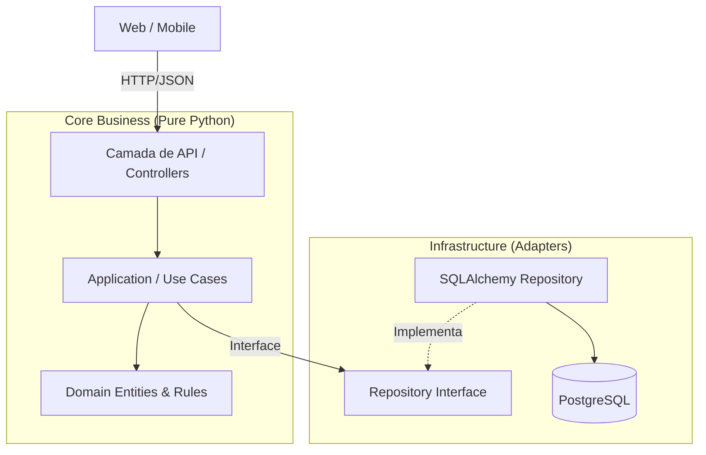
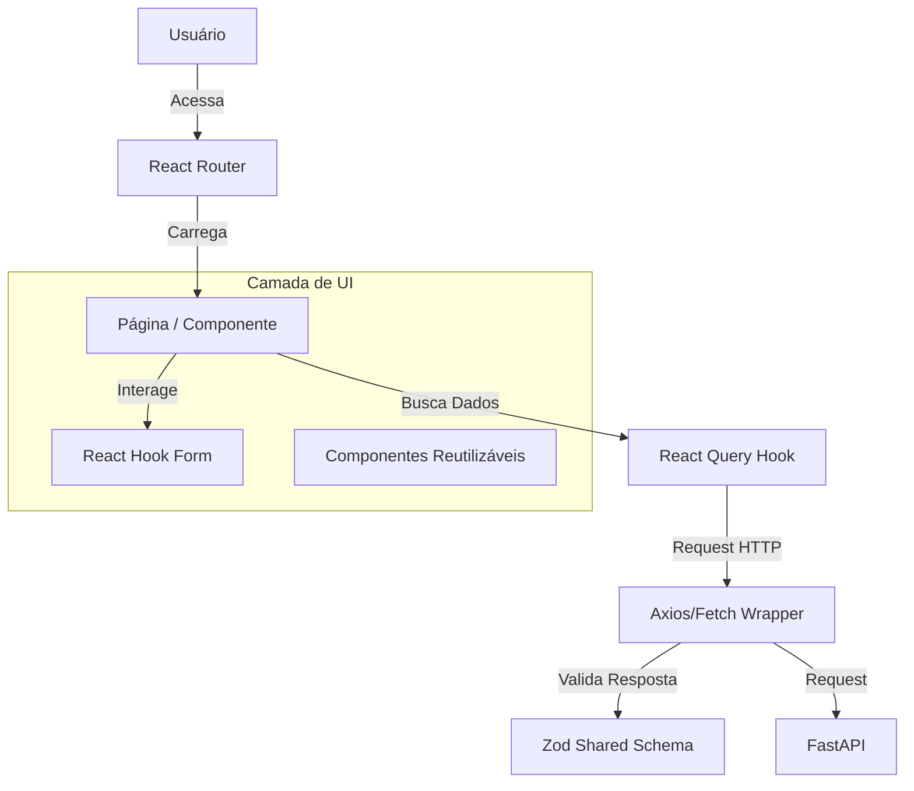

# Visão Geral e Arquitetura - Filadelfias

Este documento define a arquitetura técnica e a estratégia de implementação do projeto **Filadelfias**, um aplicativo multi-tenant para gestão eclesiástica focado em princípios reformados.

## 🏗️ Stack Tecnológica

### Backend (`/backend`)
*   **Linguagem**: Python 3.11+
*   **Framework**: FastAPI
*   **Arquitetura**: Clean Architecture / Ports and Adapters.
*   **ORM**: SQLAlchemy (Async)
*   **Banco de Dados**: PostgreSQL (Gerenciado na DigitalOcean ou Docker local)
*   **Migrações**: Alembic
*   **Autenticação**: JWT (OAuth2 Password Bearer)

**Diagrama de Arquitetura Backend**:



*   **ORM**: SQLAlchemy (Async)
*   **Banco de Dados**: PostgreSQL (Gerenciado na DigitalOcean ou Docker local)
*   **Gerenciamento de Dependências**: Poetry.
*   **Autenticação**: JWT (OAuth2 Password Bearer)
*   **Testes**:
    *   **Unitários e Integrados**: Pytest (com `pytest-asyncio` e Testcontainers para DB integrado).
    *   **Mocks**: Apenas onde estritamente necessário; preferência por containers reais.

### Web & Mobile Testing Strategy
*   **Unitários/Componentes**: Vitest + React Testing Library (Web) / React Native Testing Library (Mobile).
*   **E2E (End-to-End)**:
    *   **Ferramenta**: Playwright (Web) / Maestro ou Detox (Mobile - a definir, preferência Maestro pela simplicidade).
    *   **Metodologia**: BDD (Behavior Driven Development) com Gherkin (`.feature` files).
    *   **Runner**: `pytest-bdd` (para orquestrar testes E2E do Python) ou `cucumber-js` (nativo JS). *Recomendação: Manter steps em JS/TS para stack frontend.*

### 1. Aplicação Web (`apps/web`)

**Tecnologias Core**: React 19, TypeScript, **Vite** (Build Tool).

**Estrutura Lógica**:
*   **Camada de UI**: Biblioteca de componentes baseada em Radix UI + TailwindCSS (shadcn/ui), garantindo acessibilidade e design system consistente.
*   **Camada de Estado**:
    *   **Server State**: `TanStack Query` (React Query) para cache, retry automáticos e sincronização com o Backend.
    *   **Client State**: `Zustand` ou React Context para estados globais simples (ex: tema, toggle de menu).
    *   **Formulários**: `React Hook Form` + `Zod` (validação compartilhada).
*   **Camada de Rotas**: `React Router v7` (suporte a Data Loaders).

**Diagrama de Fluxo Web**:



**Padrões de Projeto do Frontend**:
*   **Atomic Design (Adaptado)**: `components/ui` (átomos), `components/features` (moléculas/organismos).
*   **Custom Hooks**: Lógica de negócios encapsulada em hooks (ex: `useAuth`, `useBibleVerse`).

### 2. Aplicação Mobile (`apps/mobile`)
*   **Tecnologia**: React Native com **Expo** (Managed Workflow).
*   **Arquitetura**:
    *   Similar à Web, reutilizando a lógica de Queries e Zod Schemas.
    *   **Storage**: `MMKV` para chave-valor rápido, `SQLite` para banco local (Bíblia Offline).
    *   **Navegação**: `Expo Router` (File-based routing, alinhado com a Web).

### 3. Backend e Dados (`apps/backend`)
*(Detalhado na seção de API, mantendo foco em FastAPI Async e SQLAlchemy)*


### Shared (`/contracts`)
*   **Objetivo**: Compartilhar tipos e validações entre Frontend e Backend.
*   **Ferramenta**: Zod (geração de tipos TypeScript e validação runtime).
*   **Nota**: Podemos usar ferramentas para gerar Pydantic models a partir do Zod ou vice-versa, ou manter sincronia manual controlada por testes de contrato.

## 📂 Estrutura de Diretórios (Monorepo)
```
/
├── apps/
│   ├── backend/
│   ├── web/
│   └── mobile/
├── packages/
│   ├── contracts/ (Zod schemas)
│   ├── config/ (ESLint, TSConfig)
│   └── ui/ (Design System compartilhado - opcional futuro)
├── plan/ (Documentação de planejamento)
├── docker-compose.yml
└── README.md
```
*(Nota: Sugiro usar `pnpm` workspaces para gerenciar as dependências do monorepo)*

## 📅 Fases de Implementação

O desenvolvimento será dividido em fases conforme os arquivos de planejamento:

*   **[Fase 1: Setup e Fundamentos](plan_1.md)**
    *   Setup do Monorepo e Infraestrutura.
    *   Core: Autenticação, Multi-tenancy (Igrejas).
    *   Funcionalidades MVP: Bíblia, Comunicados.
*   **[Fase 2: Vida Comunitária](plan_2.md)**
    *   Membros, Visitas, Oração, Eventos, Escalas.
*   **[Fase 2.1: Portal Público e Expansão](plan_2.1_portal.md)**
    *   Landing Page, Bíblia Online, Hinário, Cadastro de Igrejas.
*   **[Fase 3: Governo e Atos Oficiais](plan_3.md)**
    *   Assembleias, Votações, Atas, Cargos e Eleições.
*   **[Fase 4: Tesouraria e Administração](plan_4.md)**
    *   Gestão Financeira, Relatórios, Auditoria.
*   **[Fase 5: Missões e Expansão](plan_5.md)**
    *   Mapa Missionário, Parcerias, i18n, API Pública.
*   **[Fase 6: Educação Cristã (EBD)](plan_6.md)**
    *   Gestão de Classes, Lições, Frequência e Atividades para Casa.

## 🔐 Princípios de Segurança e Design
1.  **Multi-tenancy com Isolamento Lógico**: Cada query deve filtrar obrigatoriamente pelo `tenant_id` (Igreja).
2.  **Clean Architecture**: Backend organizado em `domain`, `application`, `infra`, `api`.
3.  **Design Premium**: Interface minimalista, tipografia excelente (Inter/Geist), Cores sóbrias e elegantes.
4.  **Async First**: Todos os endpoints do FastAPI e chamadas de I/O (Banco de dados, S3, APIs externas) devem ser assíncronos (`async def`).

## 👥 Perfis e Cargos (Roles)
*   **Visitante**: Acesso limitado (Bíblia, Hinário, Informativos Públicos). Não vota.
*   **Membro Comungante**: Acesso a devocionais exclusivos, votação (quando presencial), orações.
*   **Oficiais**:
    *   **Diáconos**: Gestão de assistência, ordem do culto.
    *   **Presbíteros**: Governo, disciplina, supervisão.
    *   **Pastores**: Ensino, administração dos sacramentos.
*   **Lideranças**:
    *   Presidentes de Sociedades Internas (SAF, UMP, UPH).
    *   Superintendentes/Professores de Escola Dominical.
    *   Diretores de Música/Regentes.
